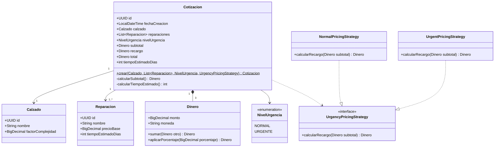
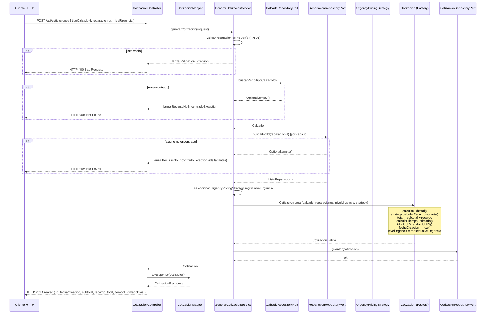

# Documento de Diseño — Cotizador de Calzado

## Resumen

Este documento describe el diseño técnico del backend de cotizaciones para un taller de reparación de calzado. La solución sigue la arquitectura hexagonal (Ports & Adapters), organizada en tres capas: **dominio**, **aplicación** e **infraestructura**. La capa de dominio contiene la lógica de negocio pura; la capa de aplicación orquesta los casos de uso a través de puertos de entrada y salida; la capa de infraestructura provee adaptadores REST y repositorios en memoria.

---

## Arquitectura General

La aplicación sigue el patrón de Arquitectura Hexagonal. La regla de dependencia establece que las capas externas dependen de las internas, nunca al revés.

```
┌─────────────────────────────────────────────────────────┐
│                   INFRASTRUCTURE                         │
│  ┌──────────────────┐    ┌───────────────────────────┐  │
│  │  CotizacionCtrl  │    │  InMemory*Adapters (x3)   │  │
│  │  (REST Adapter)  │    │  (Persistence Adapters)   │  │
│  └────────┬─────────┘    └─────────────┬─────────────┘  │
│           │                            │                  │
│  ─ ─ ─ ─ │ ─ ─ ─ ─ ─ ─ ─ ─ ─ ─ ─ ─ │ ─ ─ ─ ─ ─ ─ ─ ─│
│                   APPLICATION                            │
│  ┌──────────────────────────────────────────────────┐   │
│  │  GenerarCotizacionService / ConsultarCatalogoSvc │   │
│  │  (implements InPorts, uses OutPorts)             │   │
│  └─────────────────────┬────────────────────────────┘   │
│           │             │                                 │
│  ─ ─ ─ ─ │ ─ ─ ─ ─ ─ ─│ ─ ─ ─ ─ ─ ─ ─ ─ ─ ─ ─ ─ ─ ─ │
│                     DOMAIN                               │
│  ┌─────────────────────────────────────────────────┐    │
│  │  Cotizacion · Calzado · Reparacion              │    │
│  │  UrgencyPricingStrategy (interface + impls)     │    │
│  └─────────────────────────────────────────────────┘    │
└─────────────────────────────────────────────────────────┘
```

### Diagrama de componentes (Mermaid)

```mermaid
graph TD
  subgraph infrastructure["Capa: Infrastructure"]
    CC["CotizacionController\n(REST Adapter)"]
    ICA["InMemoryCotizacionRepositoryAdapter"]
    ICAL["InMemoryCalzadoRepositoryAdapter"]
    IREP["InMemoryReparacionRepositoryAdapter"]
    CMAP["CotizacionMapper"]
  end

  subgraph application["Capa: Application"]
    GCU["GenerarCotizacionUseCase\n(puerto de entrada)"]
    CCU["ConsultarCatalogoUseCase\n(puerto de entrada)"]
    GCS["GenerarCotizacionService\n(implementación)"]
    CCS["ConsultarCatalogoService\n(implementación)"]
    CRP["CotizacionRepositoryPort\n(puerto de salida)"]
    CALP["CalzadoRepositoryPort\n(puerto de salida)"]
    REPP["ReparacionRepositoryPort\n(puerto de salida)"]
  end

  subgraph domain["Capa: Domain"]
    COT["Cotizacion"]
    CAL["Calzado"]
    REP["Reparacion"]
    UPS["UrgencyPricingStrategy\n(interface)"]
    NPS["NormalPricingStrategy"]
    UURG["UrgentPricingStrategy"]
  end

  CC -->|usa| GCU
  CC -->|usa| CCU
  CC -->|usa| CMAP
  GCS -->|implementa| GCU
  GCS -->|llama| CRP
  GCS -->|llama| CALP
  GCS -->|llama| REPP
  GCS -->|delega recargo a| UPS
  CCS -->|implementa| CCU
  CCS -->|llama| CALP
  CCS -->|llama| REPP
  ICA -->|implementa| CRP
  ICAL -->|implementa| CALP
  IREP -->|implementa| REPP
  UPS -->|implementado por| NPS
  UPS -->|implementado por| UURG
  GCS -->|crea| COT
  COT -->|referencia| CAL
  COT -->|referencia| REP
```



---

## Modelo de Dominio

### Entidades y Value Objects

| Clase | Tipo | Responsabilidad |
|---|---|---|
| `Cotizacion` | Entidad | Agrega calzado + reparaciones, encapsula cálculos de subtotal, recargo y total |
| `Calzado` | Entidad | Tipo de calzado con su factor de complejidad |
| `Reparacion` | Entidad | Servicio de reparación con precio base y tiempo estimado |
| `Dinero` | Value Object | Encapsula un valor monetario (monto + moneda); ofrece operaciones `sumar` y `aplicarPorcentaje` |
| `NivelUrgencia` | Enum | Representa el nivel de urgencia de la cotización; valores: `NORMAL`, `URGENTE` |

### Diagrama de clases (Mermaid)



### Reglas de negocio del dominio

| ID | Regla |
|---|---|
| RN-01 | La lista de reparaciones no puede estar vacía |
| RN-02 | El subtotal = Σ(precioBase_i × factorComplejidad) para cada reparación |
| RN-03 | Tiempo estimado sin urgencia = max(tiemposEstimadosDias de reparaciones) |
| RN-04 | Tiempo estimado con urgencia = max(1, ⌈max(tiempos) / 2⌉) |
| RN-05 | La cotización recibe un UUID y una `FechaCreacion` en el momento de creación; nunca puede existir sin ellos |

---

## Puertos de Entrada (Casos de Uso)

### `GenerarCotizacionUseCase`

```java
public interface GenerarCotizacionUseCase {
    Cotizacion generarCotizacion(CotizacionRequest request);
}
```

Orquesta: validación → búsqueda de calzado y reparaciones → selección de estrategia de precios → `Cotizacion.crear(...)` → persistencia.

### `ConsultarCatalogoUseCase`

```java
public interface ConsultarCatalogoUseCase {
    List<Calzado> listarCalzados();
    List<Reparacion> listarReparaciones();
}
```

Delega directamente a los repositorios correspondientes.

---

## Puertos de Salida (Repositorios)

### `CotizacionRepositoryPort`

```java
public interface CotizacionRepositoryPort {
    void guardar(Cotizacion cotizacion);
}
```

### `CalzadoRepositoryPort`

```java
public interface CalzadoRepositoryPort {
    List<Calzado> listarTodos();
    Optional<Calzado> buscarPorId(UUID id);
}
```

### `ReparacionRepositoryPort`

```java
public interface ReparacionRepositoryPort {
    List<Reparacion> listarTodos();
    Optional<Reparacion> buscarPorId(UUID id);
}
```

---

## Adaptadores de Entrada (REST)

### `CotizacionController`

| Método | Ruta | Entrada | Respuesta exitosa |
|---|---|---|---|
| GET | `/api/tipos-calzado` | — | HTTP 200, `List<CalzadoResponse>` |
| GET | `/api/tipos-reparacion` | — | HTTP 200, `List<ReparacionResponse>` |
| POST | `/api/cotizaciones` | `CotizacionRequest` (JSON) | HTTP 201, `CotizacionResponse` |

El controlador delega en los casos de uso; nunca contiene lógica de negocio. Captura excepciones de dominio y las traduce a códigos HTTP mediante un `@ControllerAdvice`.

### DTOs

**`CotizacionRequest`**

```java
public record CotizacionRequest(
    UUID tipoCalzadoId,
    List<UUID> reparacionIds,
    NivelUrgencia nivelUrgencia
) {}
```

**`CotizacionResponse`**

```java
public record CotizacionResponse(
    UUID id,
    String fechaCreacion,        // ISO-8601 yyyy-MM-ddTHH:mm:ss
    UUID tipoCalzadoId,
    String nombreCalzado,
    List<UUID> reparacionIds,
    NivelUrgencia nivelUrgencia,
    BigDecimal subtotal,
    BigDecimal recargo,
    BigDecimal total,
    int tiempoEstimadoDias
) {}
```

### `CotizacionMapper`

Responsabilidad única: convertir entre `Cotizacion` (dominio) y `CotizacionResponse` (DTO), y validar/proyectar `CotizacionRequest` antes de enviarlo al caso de uso.

```java
public class CotizacionMapper {
    public CotizacionResponse toResponse(Cotizacion cotizacion);
}
```

---

## Adaptadores de Salida (Infraestructura)

### `InMemoryCotizacionRepositoryAdapter`

Implementa `CotizacionRepositoryPort`. Almacena cotizaciones en un `Map<UUID, Cotizacion>` inicializado en memoria. No requiere datos semilla.

### `InMemoryCalzadoRepositoryAdapter`

Implementa `CalzadoRepositoryPort`. Inicializa con los siguientes datos semilla al arrancar:

| id | nombre | factorComplejidad |
|---|---|---|
| *(UUID fijo)* | Bota de cuero | 1.50 |
| *(UUID fijo)* | Zapatilla deportiva | 1.10 |
| *(UUID fijo)* | Zapato formal | 1.25 |
| *(UUID fijo)* | Sandalia | 0.90 |

### `InMemoryReparacionRepositoryAdapter`

Implementa `ReparacionRepositoryPort`. Inicializa con:

| id | nombre | precioBase | tiempoEstimadoDias |
|---|---|---|---|
| *(UUID fijo)* | Cambio de suela | 35 000 | 5 |
| *(UUID fijo)* | Limpieza profunda | 15 000 | 2 |
| *(UUID fijo)* | Costura de refuerzo | 20 000 | 3 |
| *(UUID fijo)* | Tintado | 25 000 | 4 |

Los UUIDs fijos se definen como constantes en cada adaptador para garantizar reproducibilidad en las pruebas.

---

## Patrones de Diseño

### Strategy — `UrgencyPricingStrategy`

**Problema:** el cálculo del recargo varía según el nivel de urgencia y debe ser extensible sin modificar la lógica existente (principio abierto/cerrado).

**Implementación:**

```
UrgencyPricingStrategy (interface)
  ├── NormalPricingStrategy  → siempre retorna Dinero.ZERO (monto 0)
  └── UrgentPricingStrategy  → retorna subtotal.aplicarPorcentaje(0.30)
```

`GenerarCotizacionService` selecciona la implementación correcta según el valor de `NivelUrgencia` del request antes de llamar a `Cotizacion.crear(...)`.

---

### Factory Method — `Cotizacion.crear(...)`

**Problema:** garantizar que nunca exista una `Cotizacion` en estado inválido (sin id, sin fechaCreacion, con lista vacía de reparaciones).

**Implementación:** método estático de fábrica que:
1. Valida que `reparaciones` no esté vacía (RN-01).
2. Calcula `subtotal`, `recargo` (vía estrategia), `total` y `tiempoEstimadoDias`.
3. Asigna `id = UUID.randomUUID()`, `fechaCreacion = LocalDateTime.now()` (RN-05) y `nivelUrgencia`.
4. Retorna la instancia completa y válida.

El constructor queda privado o de acceso restringido al paquete.

---

### Repository — Tres puertos de salida

`CotizacionRepositoryPort`, `CalzadoRepositoryPort` y `ReparacionRepositoryPort` son interfaces del paquete de aplicación. Los adaptadores `InMemory*` en infraestructura los implementan. Esto desacopla el dominio de cualquier tecnología de persistencia: reemplazar la implementación en memoria por JPA no requiere tocar el dominio ni la aplicación.

---

### DTO + Mapper — `CotizacionMapper`

**Problema:** evitar que el modelo de dominio quede acoplado al contrato HTTP.

**Flujo:**
```
HTTP Request → CotizacionRequest (DTO) → [Controller] → UseCase
                                                           ↓
HTTP Response ← CotizacionResponse (DTO) ← [Mapper] ← Cotizacion (dominio)
```

`CotizacionMapper` es el único lugar donde existe conocimiento de ambos mundos. El dominio nunca importa clases de la capa HTTP.

---

### Inyección de Dependencias

Los servicios de aplicación (`GenerarCotizacionService`, `ConsultarCatalogoService`) reciben sus dependencias por constructor:

```java
public class GenerarCotizacionService implements GenerarCotizacionUseCase {
    private final CalzadoRepositoryPort calzadoRepository;
    private final ReparacionRepositoryPort reparacionRepository;
    private final CotizacionRepositoryPort cotizacionRepository;

    public GenerarCotizacionService(
        CalzadoRepositoryPort calzadoRepository,
        ReparacionRepositoryPort reparacionRepository,
        CotizacionRepositoryPort cotizacionRepository
    ) { ... }
}
```

El framework (Spring) inyecta las implementaciones concretas en tiempo de arranque. La capa de aplicación sólo conoce las interfaces (puertos), nunca las clases concretas de infraestructura.

---

## Flujo de `POST /api/cotizaciones`

### Diagrama de secuencia (Mermaid)



---

## Manejo de Errores

### Excepciones de dominio

| Excepción | Condición | Código HTTP |
|---|---|---|
| `ValidacionException` | Lista de reparaciones vacía | 400 |
| `RecursoNoEncontradoException` | Id de calzado o reparación no existe en catálogo | 404 |
| `ErrorInternoException` | Fallo al acceder a un repositorio | 500 |

### Estrategia

- Un `@ControllerAdvice` global (`GlobalExceptionHandler`) captura las excepciones de dominio y las convierte en respuestas JSON estructuradas:

```json
{
  "error": "RECURSO_NO_ENCONTRADO",
  "mensaje": "Tipo de calzado con id '...' no fue encontrado.",
  "timestamp": "2024-01-15T10:30:00"
}
```

- Las excepciones no controladas (`RuntimeException`, errores de repositorio) producen HTTP 500 con mensaje genérico para no exponer detalles internos.

---

## Propiedades de Corrección

*Una propiedad es una característica o comportamiento que debe cumplirse en todas las ejecuciones válidas del sistema — esencialmente, un enunciado formal sobre lo que el sistema debe hacer. Las propiedades sirven como puente entre las especificaciones legibles por humanos y las garantías de corrección verificables por máquinas.*

---

### Propiedad 1: El subtotal es la suma exacta de productos precio × factor

*Para cualquier* `Calzado` con `factorComplejidad > 0` y lista no vacía de `Reparacion` con `precioBase ≥ 0`, el subtotal calculado por `Cotizacion.crear(...)` debe ser exactamente igual a `Σ(precioBase_i × factorComplejidad)`.

**Valida: Requisito 3.2**

---

### Propiedad 2: Recargo cero cuando nivelUrgencia=NORMAL; 30 % del subtotal cuando nivelUrgencia=URGENTE

*Para cualquier* cotización generada con `NivelUrgencia.NORMAL`, el recargo debe ser `Dinero` con monto `0`. *Para cualquier* cotización generada con `NivelUrgencia.URGENTE`, el recargo debe ser exactamente `subtotal.aplicarPorcentaje(0.30)`.

**Valida: Requisitos 3.3, 4.1**

---

### Propiedad 3: El total siempre es subtotal + recargo

*Para cualquier* cotización generada (con o sin urgencia), `total = subtotal + recargo`. Esta invariante se cumple independientemente del flag de urgencia, del número de reparaciones y del factor de complejidad del calzado.

**Valida: Requisitos 3.3, 4.2**

---

### Propiedad 4: El tiempo estimado respeta la fórmula correcta según urgencia

*Para cualquier* lista no vacía de reparaciones:
- Si `nivelUrgencia = NivelUrgencia.NORMAL`: `tiempoEstimadoDias = max(tiempoEstimadoDias_i)`.
- Si `nivelUrgencia = NivelUrgencia.URGENTE`: `tiempoEstimadoDias = max(1, ⌈max(tiempoEstimadoDias_i) / 2⌉)`.

Esta propiedad es especialmente valiosa para verificar los casos borde de redondeo hacia arriba (días impares) y el mínimo de 1 día.

**Valida: Requisitos 4.3, 5.1, 5.2**

---

### Propiedad 5: Toda cotización generada tiene id UUID no nulo y fechaCreacion no nula

*Para cualquier* request válida procesada por `GenerarCotizacionUseCase`, la cotización resultante debe tener `id != null`, `id` debe ser un UUID válido, y `fechaCreacion != null`.

**Valida: Requisito 3.4**

---

### Propiedad 6: Persistencia — toda cotización generada es recuperable por su id

*Para cualquier* cotización generada exitosamente, el `CotizacionRepositoryPort` debe haber persistido el objeto y debe ser localizable internamente por su `id`.

**Valida: Requisito 3.6**

---

### Propiedad 7: Validación — listas vacías de reparaciones siempre son rechazadas

*Para cualquier* request con lista de reparaciones vacía (incluyendo listas de tamaño cero con distintos valores de `tipoCalzadoId` y `nivelUrgencia`), `GenerarCotizacionUseCase` debe rechazar la solicitud con `ValidacionException`.

**Valida: Requisito 6.1**

---

### Propiedad 8: Validación — ids inexistentes siempre producen error de no encontrado

*Para cualquier* id de calzado o reparación que no exista en el repositorio correspondiente, `GenerarCotizacionUseCase` debe lanzar `RecursoNoEncontradoException`, independientemente de los demás campos del request.

**Valida: Requisitos 6.3, 6.5**

---

## Estrategia de Pruebas

### Pruebas unitarias (ejemplo-based)

Se escriben con JUnit 5 + Mockito. Cubren:

- Comportamiento del controlador (mapeo de excepciones → códigos HTTP).
- `CotizacionMapper`: conversión correcta de entidad a DTO.
- Casos específicos de `GlobalExceptionHandler`.
- Comportamiento de `NormalPricingStrategy` y `UrgentPricingStrategy` con valores concretos.
- Datos semilla: que los repositorios en memoria estén inicializados con los elementos esperados.

No se deben escribir excesivas pruebas unitarias para lógica cubierta por las propiedades.

### Pruebas de propiedades (property-based)

Se usa **[jqwik](https://jqwik.net/)** como biblioteca de property-based testing para Java.

Cada propiedad se implementa como una única prueba anotada con `@Property`, configurada con mínimo **100 iteraciones** (`tries = 100`). Cada prueba lleva un comentario de trazabilidad:

```java
// Feature: cotizacion-calzado, Propiedad 1: El subtotal es la suma exacta de productos precio × factor
@Property(tries = 100)
void subtotalEsSumaDeProductos(...) { ... }
```

| Propiedad | Clase de prueba | Generadores |
|---|---|---|
| P1 — Subtotal | `CotizacionSubtotalPropertyTest` | `@ForAll BigDecimal factorComplejidad`, `@ForAll List<BigDecimal> preciosBases` |
| P2 — Recargo | `UrgencyPricingStrategyPropertyTest` | `@ForAll BigDecimal subtotal`, `@ForAll NivelUrgencia nivelUrgencia` |
| P3 — Total | `CotizacionTotalPropertyTest` | combinación de P1 + P2 |
| P4 — Tiempo estimado | `TiempoEstimadoPropertyTest` | `@ForAll List<Integer> tiempos`, `@ForAll NivelUrgencia nivelUrgencia` |
| P5 — Id y fecha no nulos | `CotizacionIdentidadPropertyTest` | request aleatorio válido completo |
| P6 — Persistencia | `CotizacionPersistenciaPropertyTest` | request aleatorio válido + repositorio en memoria |
| P7 — Rechazo lista vacía | `ValidacionReparacionesPropertyTest` | `@ForAll UUID calzadoId`, `@ForAll NivelUrgencia nivelUrgencia` |
| P8 — Rechazo id inválido | `ValidacionIdsPropertyTest` | UUID aleatorio no presente en el repositorio |

### Pruebas de integración

Se usa **Spring Boot Test** + `MockMvc`. Cubren los endpoints HTTP end-to-end con el contexto de aplicación levantado:

- `GET /api/tipos-calzado` → HTTP 200 y cuerpo con datos semilla.
- `GET /api/tipos-reparacion` → HTTP 200 y cuerpo con datos semilla.
- `POST /api/cotizaciones` → HTTP 201 con cotización `NivelUrgencia.NORMAL` (ejemplo concreto).
- `POST /api/cotizaciones` → HTTP 201 con cotización `NivelUrgencia.URGENTE` (ejemplo concreto).
- `POST /api/cotizaciones` → HTTP 400 con lista vacía.
- `POST /api/cotizaciones` → HTTP 404 con id de calzado inexistente.
- `POST /api/cotizaciones` → HTTP 404 con id de reparación inexistente.
